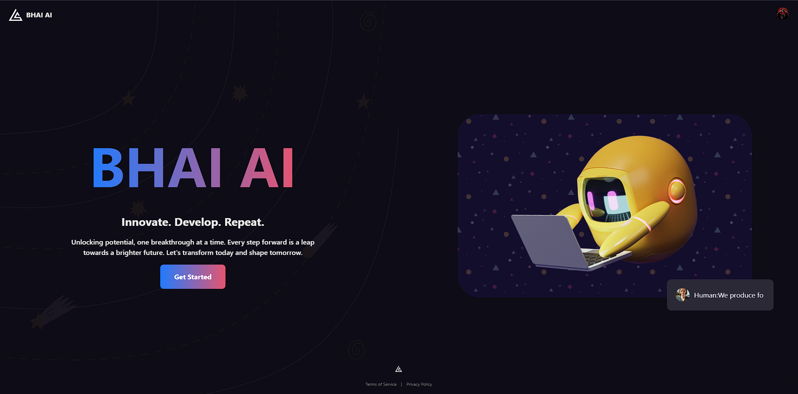
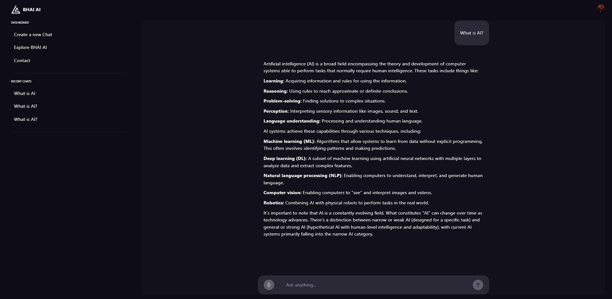
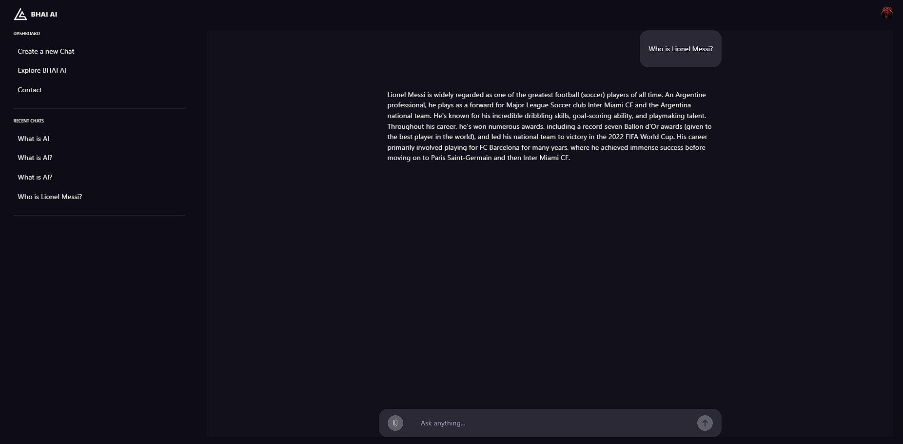

# BHAI - AI Chat Application

An AI-powered chat application built with React and Node.js.





## Features

- AI Chat Interface
- Image Analysis
- Code Helper
- User Authentication

## Tech Stack

- Frontend: React, Vite, TailwindCSS
- Backend: Node.js, Express, MongoDB
- Authentication: Clerk
- AI: Google Gemini
- Image Processing: ImageKit

## Setup Instructions

1. Clone the repository
2. Install dependencies:

   ```bash
   # Install backend dependencies
   cd bhai-backend
   npm install

   # Install frontend dependencies
   cd ../bhai-frontend
   npm install
   ```
